## Colors App

An iOS app built with Swift and Firebase for creating and sharing custom colors.

- Built entirely with **UIKit (Programmatic)**, using **Auto Layout** to create a consistent user interface and develop custom reusable UI components with **Dark Mode** compatibility.
- Implemented **MVC** architecture and adopted **MVVM** in some features to separate logic from the UI.
- Used **Firestore** for data storage and retrieval while handling user authentication with **Firebase Authentication**.

### 1. Screens

1. **Dark Mode**

These are some `dark mode` screens.

For a more detailed view, please refer to the `light mode` section.

<div style="float: left;">
    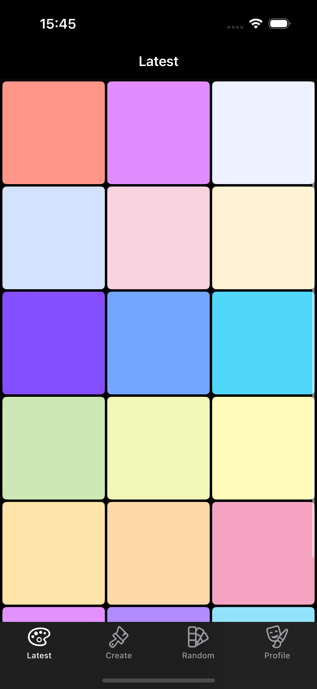
    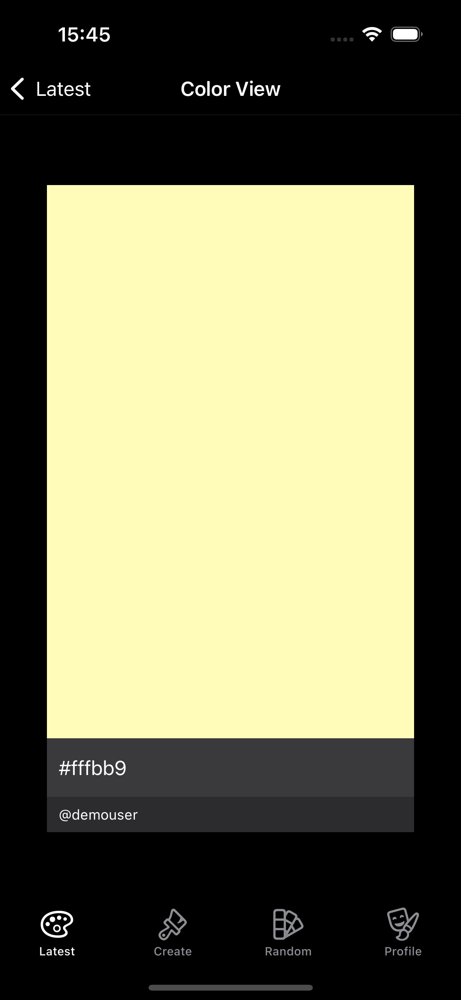
    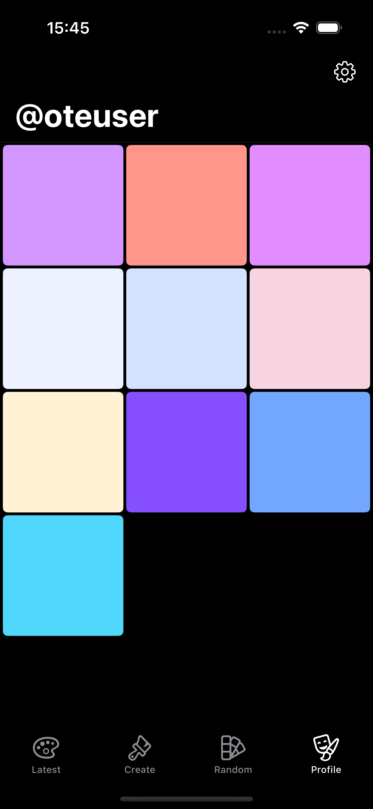
</div>

2. **Light Mode**

These are the `latest`, `color view` and `profile` screens.

<div style="float: left;">
    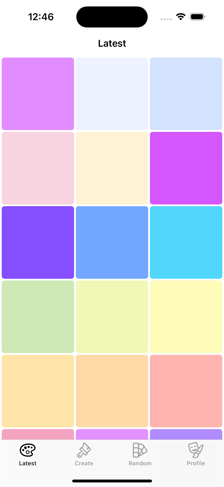
    
    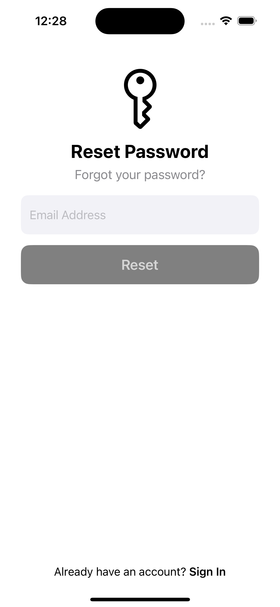
</div>

These are the `color creation` screens.

<div style="float: left;">
    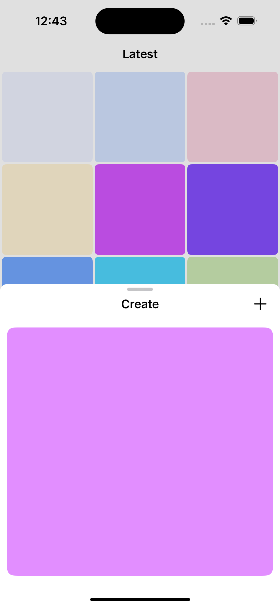
    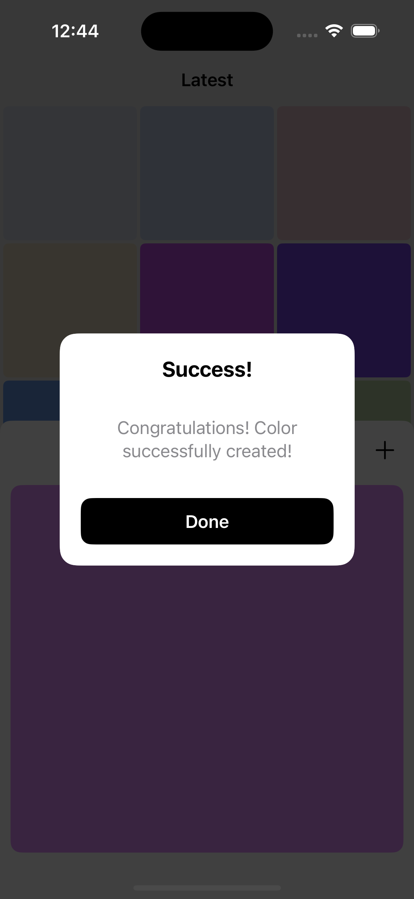
</div>

These are the `sign out`, owner’s `color view`, and `color deletion` screens.

<div style="float: left;">
    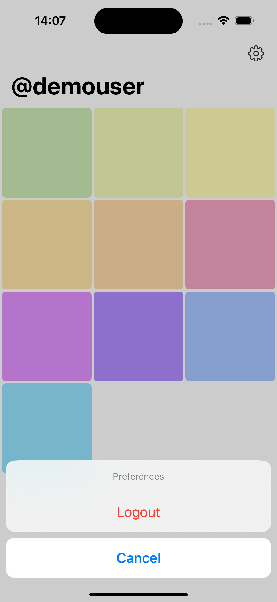
    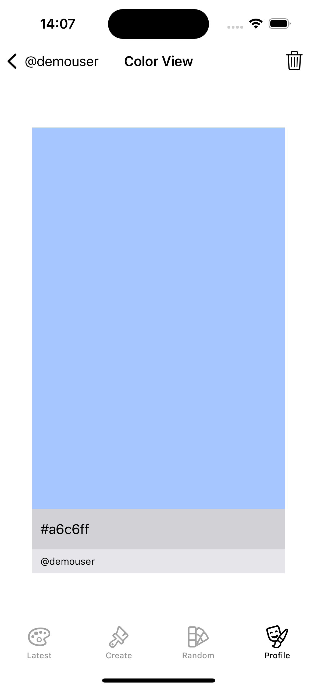
    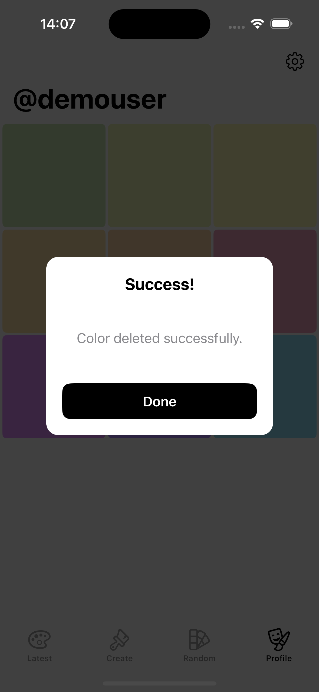
</div>

#### Auth

##### Sign In

<div style="float: left;">
    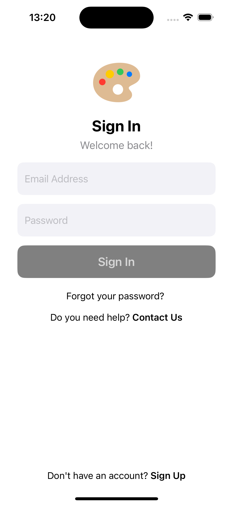
    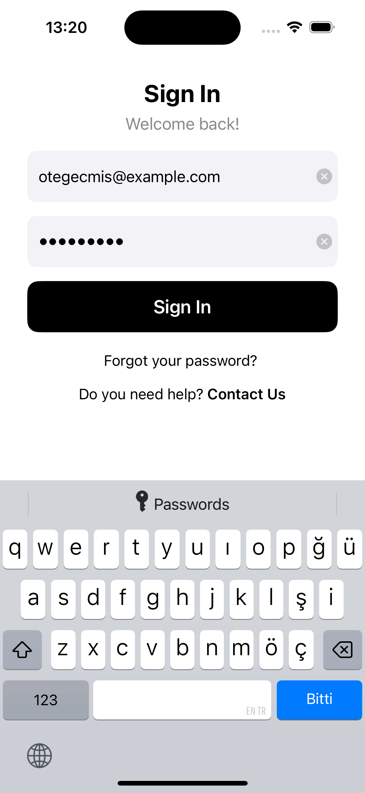 
</div>

##### Sign Up

<div style="float: left;">
    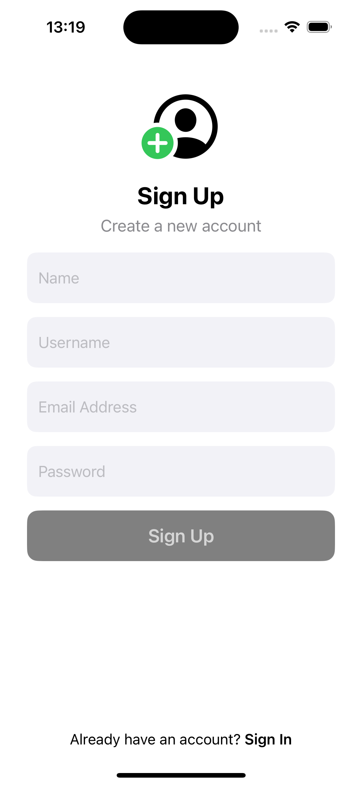
    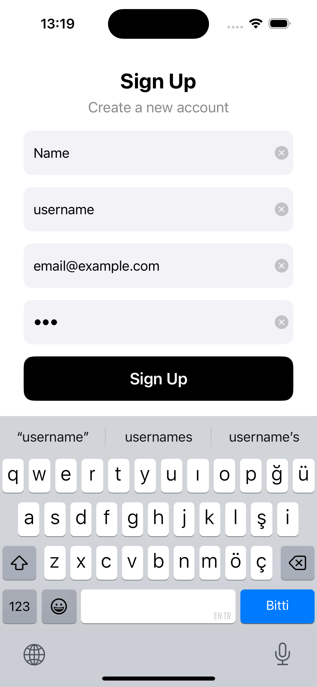
      
</div>

##### Reset Password

<div style="float: left;">
    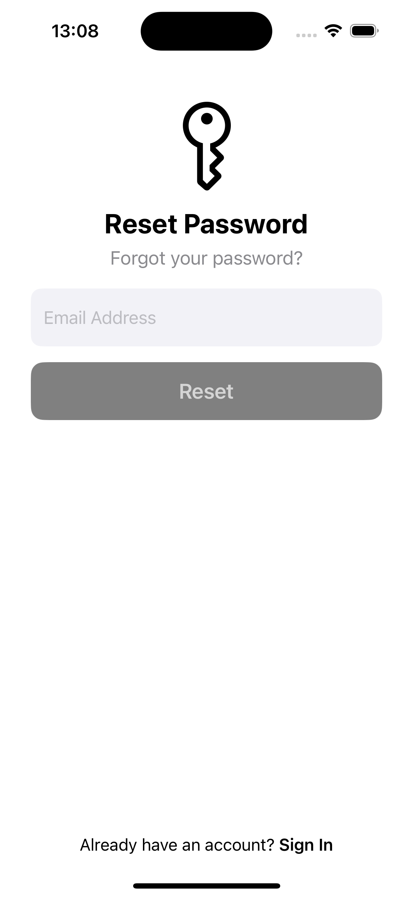
    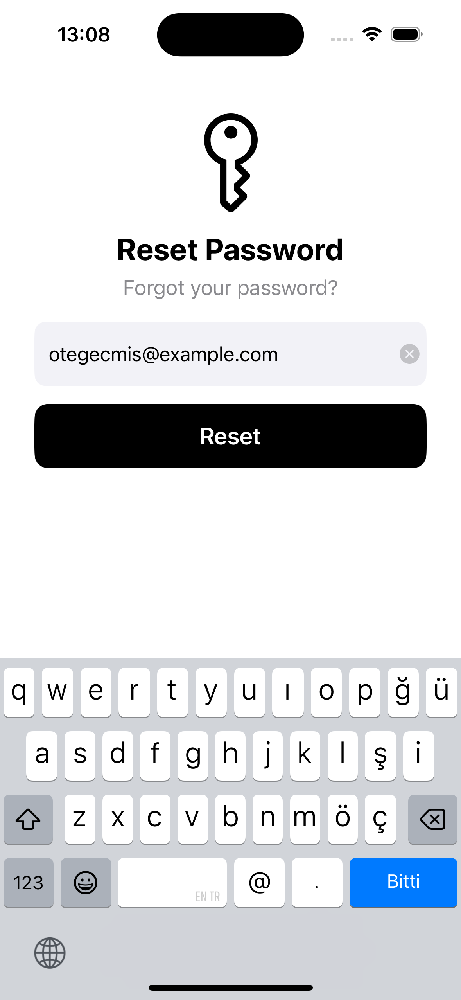
    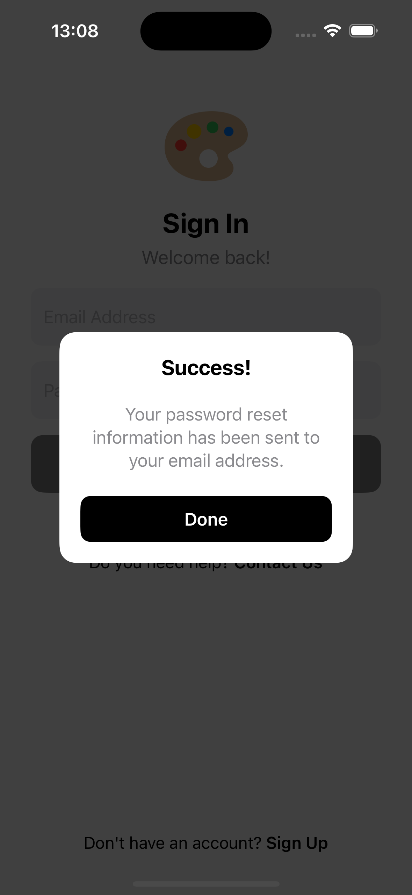  
</div>

### 2. Installation

1. **Clone the repository**

```sh
git clone https://github.com/otegecmis/colors-app.git
```

2. **Navigate to the project directory**

```sh
cd colors-app
```

3. **Open the Xcode project**

```sh
open colors-app.xcodeproj
```

4. **Set Up Firebase**

This app uses `Firestore` and `Firebase Authentication`.

Follow these steps before running the app:

- Go to `Firebase Console` and create a new project (or use an existing one).
- Download the `GoogleService-Info.plist` file from your Firebase project.
- Add the `GoogleService-Info.plist` file to your `Xcode project by dragging it into the project files`.
- Go back to the `Firebase Console` and `enable Firestore and Authentication`.

5. **Run the app**

Press the `Run` button in Xcode or use the shortcut `Cmd + R`.
