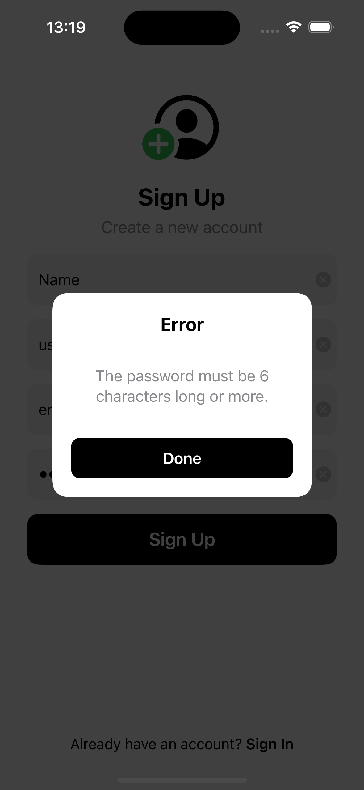

## Colors App

The Colors App is designed to let users create and share custom colors. Built entirely with `programmatic UIKit`, it leverages custom components to deliver an engaging user experience. The app is seamlessly integrated with `Firebase`, using `Firebase Authentication` for managing users and `Firestore` as the database for storing and retrieving user-generated color data.

### 1. Screens

#### 1. Latest, Random

<div style="float: left;">
    
    
    
</div>

#### 2. Create Color

<div style="float: left;">
    
    
    
    
</div>

#### 3. Auth

##### 1. Sign In

<div style="float: left;">
    
     
</div>

##### 2. Sign Up

<div style="float: left;">
    
    
      
</div>

##### 3. Reset Password

<div style="float: left;">
    
    
      
</div>

### 2. Installation

1. **Clone the repository**

```sh
git clone https://github.com/otegecmis/colors-app.git
```

2. **Navigate to the project directory**

```sh
cd colors-app
```

3. **Open the Xcode project**

```sh
open colors-app.xcodeproj
```

4. **Run the app**

Press the `Run` button in Xcode or use the shortcut `Cmd + R`.
